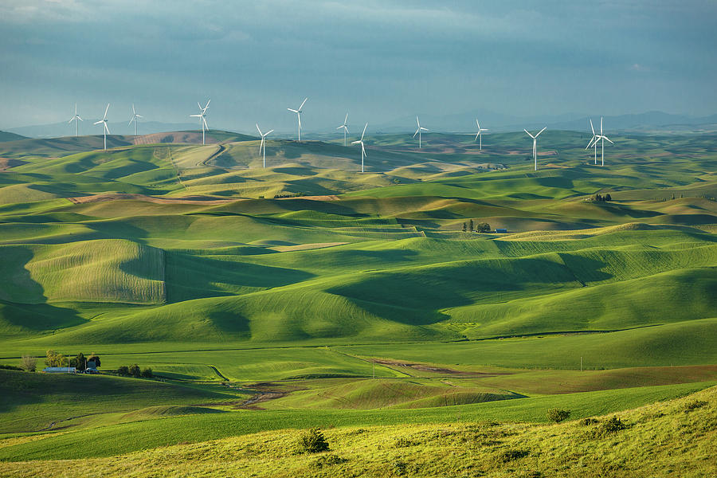

# paint-by-numbers
A tool which creates a paint by numbers kit from any photograph using Processing 3, a .
# Future Work
I created this project before I had a good understanding of image processing methods. I would like to recreate this project using kernel image processing methods such as the edge detection in my Image-Processing repository. This would increase processing time for larger resolution images and could be more reliable for certain images. Currently this project does not save an output image, and the result is viewed in the application window.
# Example:

# GUI

